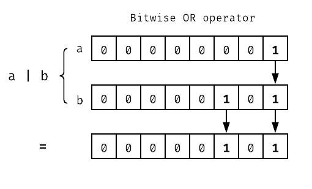
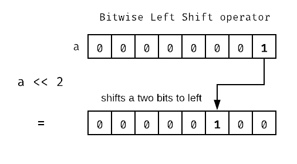
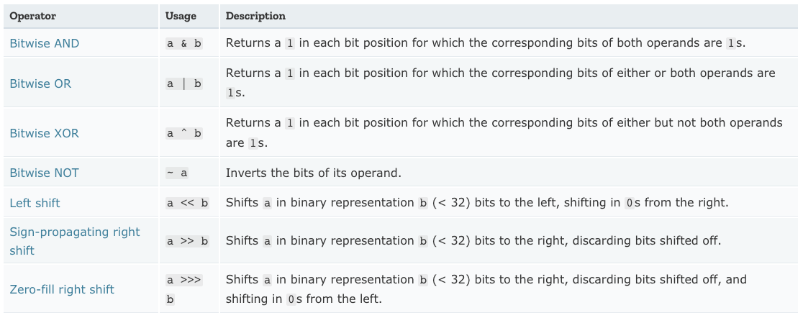

A bit field is a data structure that holds a sequence of bits. 
They are sometimes referred to as “flags” and are typically
used to store the intermediate state or outcome of a set of operations in embedded 
devices and microprocessors. They are useful data structures when you want 
to optimise for space. Bitwise operations also tend to be blazing fast.

Bit fields are suitable for encoding state that is represented by boolean properties, 
with the meaning of individual bits being determined by the programmer.
In javascript we can model a bit field using es6 binary primitives and bitwise operators.

I stumbled across bit fields recently through this tweet from Andrew Clark,
a member of the ReactJS core team:

<blockquote class="twitter-tweet" data-lang="en">
  <p lang="en" dir="ltr">React uses a bit field to track side effects. For example, to mark a component as updated:<br><br>fiber.effectTag |= Update<br><br>Then later to check whether to call componentDidUpdate:<br><br>const hasUpdate = fiber.effectTag &amp; Update<a href="https://t.co/KjXGFKXvSt">https://t.co/KjXGFKXvSt</a> <a href="https://t.co/JSPQBmhIIn">pic.twitter.com/JSPQBmhIIn</a></p>&mdash; Andrew Clark (@acdlite) <a href="https://twitter.com/acdlite/status/942526945161486336?ref_src=twsrc%5Etfw">December 17, 2017</a>
</blockquote>


The React team are making use of bit fields to track component state within the 
new fibre architecture of ReactJS! Rather than using React internals as an example 
lets try with something simpler to learn how to work with a bit field.

---

Imagine we have an object containing the feature toggle state for an application:

```js
{
  autoRefresh: false,
  sidebarWidgets: true,
  ticker: false,
}
```

Preserving key order, the above data structure can be encoded in to a bit field of
3 bits with each bit corresponding to a key in the object and it’s value 
corresponding to the value of the key:

```js
// es6 notation for a binary literal has a prefix of 0b
const appFeatureToggleState = 0b010
```

 The app config can now be passed around in the application as a number primitive.
 I know what you’re thinking - Great, what am I supposed to do with that?!

## Operating on bit fields
When working with bit fields, there are a couple of fundamental operations you’ll definitely want:

- Setting the value of a bit
- Getting the value of a bit

This is done through a combination of *masking* and *bitwise operations*. 
A mask in this context is a another value made up of bits.

Let’s define the bit masks for the feature toggle state example above:

```js
// featureFlags.js
export const defaultState = /*   */ 0b00000000 // all disabled
export const autoRefresh = /*    */ 0b00000001
export const sidebarWidgets = /* */ 0b00000010 
export const ticker = /*         */ 0b00000100
```


### Setting the value of a bit
We can set the value of a bit using the bitwise OR `|` and XOR `^` operators in javascript. 
The `|` operator returns a 1 in each bit position for which the corresponding 
bits of **either or both** operands are 1s. The `^` operator returns a 1 in each 
bit position for which the corresponding bits of **either but not both** operands are 1s.




Working with our app config example:

```js
// import our bit masks
import {
  defaultState,
  autoRefresh,
  sidebarWidgets,
  ticker,
} from '/featureFlags.js'

// set an initial state (no features enabled)
const appFeatureToggleConfig = defaultState //  0b00000000

// set autorefresh toggle to true
appFeatureToggleState |= autoRefresh //         0b00000001

// set ticker toggle to true
appFeatureToggleState |= ticker //              0b00000101

// set sidebarWidgets to true
appFeatureToggleState |= sidebarWidgets //      0b00000111

// set sidebarWidgets to false
appFeatureToggleState ^= sidebarWidgets //      0b00000101
```

### Getting the value of a bit
We can get the value of a bit using the AND `&` operator. The `&` operator 
returns a 1 in each bit position for which the corresponding bits of **both**
operands are 1s.


```js
// to check if the ticker is enabled we just have to 
// check if the operation returns our mask
if (appFeatureToggleState & ticker === ticker) { 
  ...doSomething
```

The reason we have to check that the return value matches the mask is because more 
than one value can be set in the bitfield at once; so it's not enough to check
for a truthy value.

### Getting the value of a bit without a pre-defined mask
You can save even more memory by accessing bits without pre-defined masks.
This can be done via bitshifting with the left shift `<<` operator. The `<<`
operator shifts bits from right to left in 0's. Accessing the same ticker
bit as before without the predefined mask:



```js
  // the predefined mask is now replaced with the expression (1 << n) 
  // where n === the bit you want to get
  if (appFeatureToggleState & (1 << 2) === (1 << 2)) {
    ...doSomething
```

The expression `js>(1 << x)` is equivalent to `js>Math.pow(2, x)`.  

You could also just use the literal binary value:

```js
  if (appFeatureToggleState & 0b00000100 === 0b00000100) {
    ...doSomething
```

---

When using bit fields, we are trading off readability for optimisations in 
performance/memory usage. It’s advisable to attempt other methods of optimisation 
before making use of bit fields! - However it's always good to have something in 
your back pocket for when the time calls. It also helps shed some light on the
lengths javascript library authors are going to to help shave bytes off the 
final bundle size and ensure the best performance possible.

I'll leave you with a handy table detailing javascripts bitwise operators courtesy of
[MDN](https://developer.mozilla.org/en-US/docs/Web/JavaScript/Reference/Operators/Bitwise_Operators):


